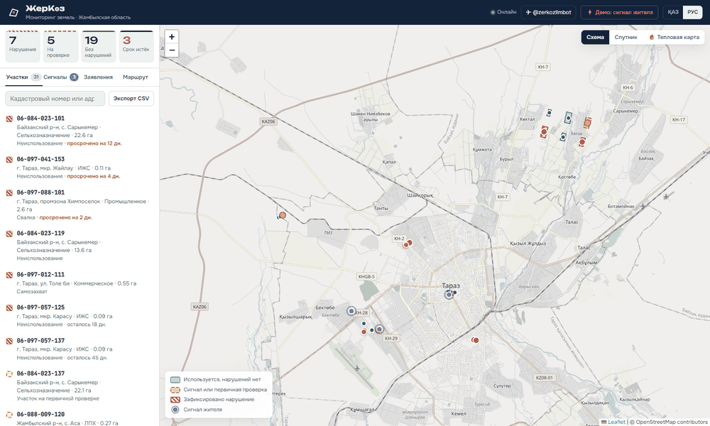
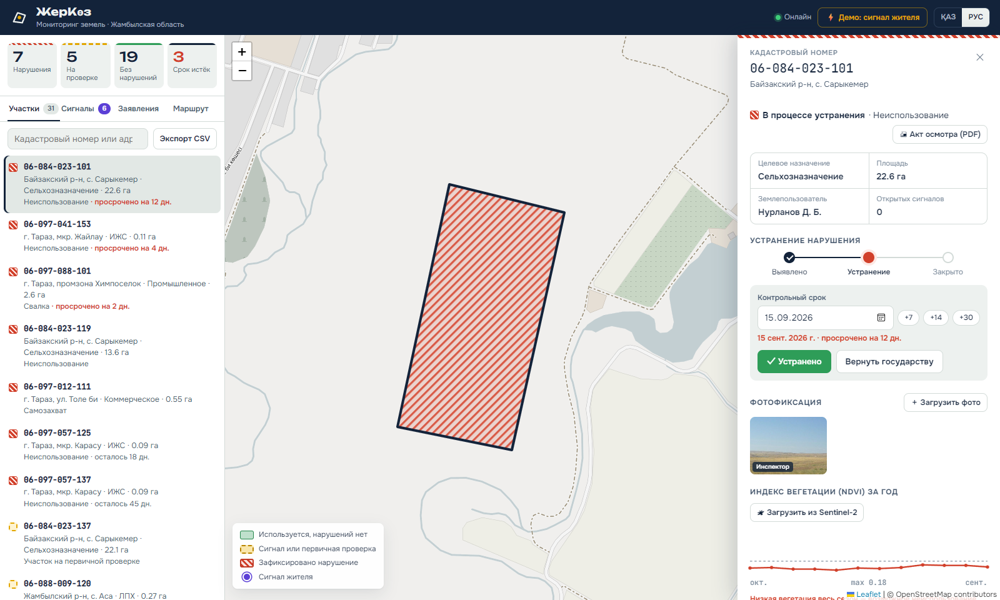
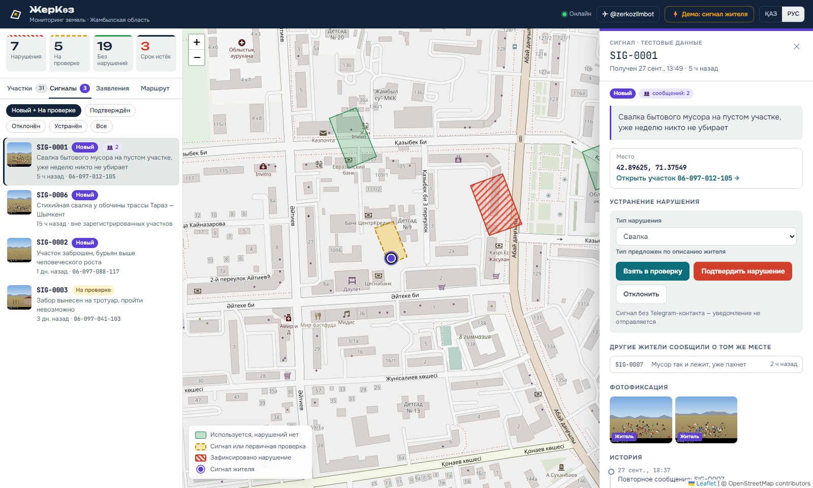
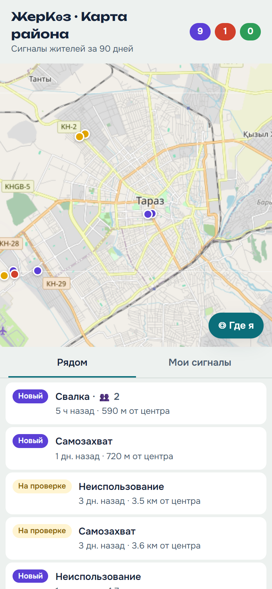
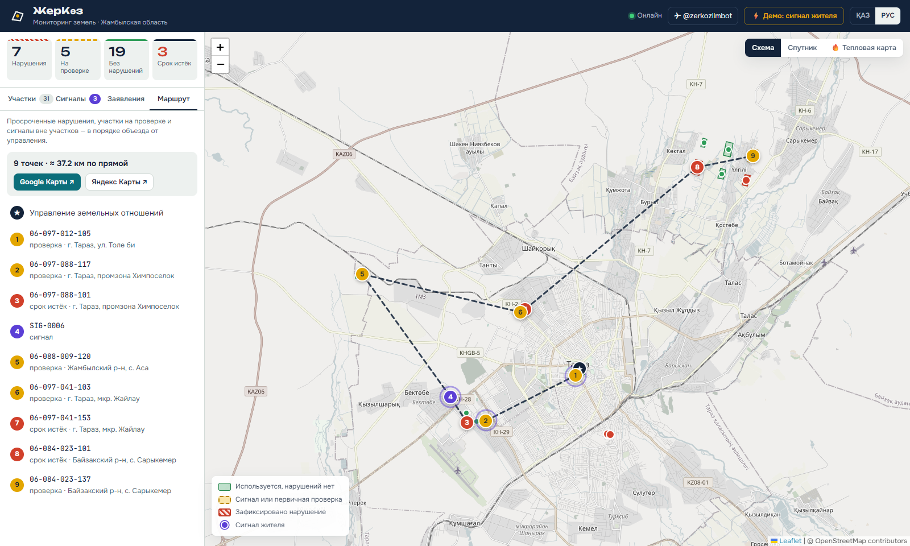
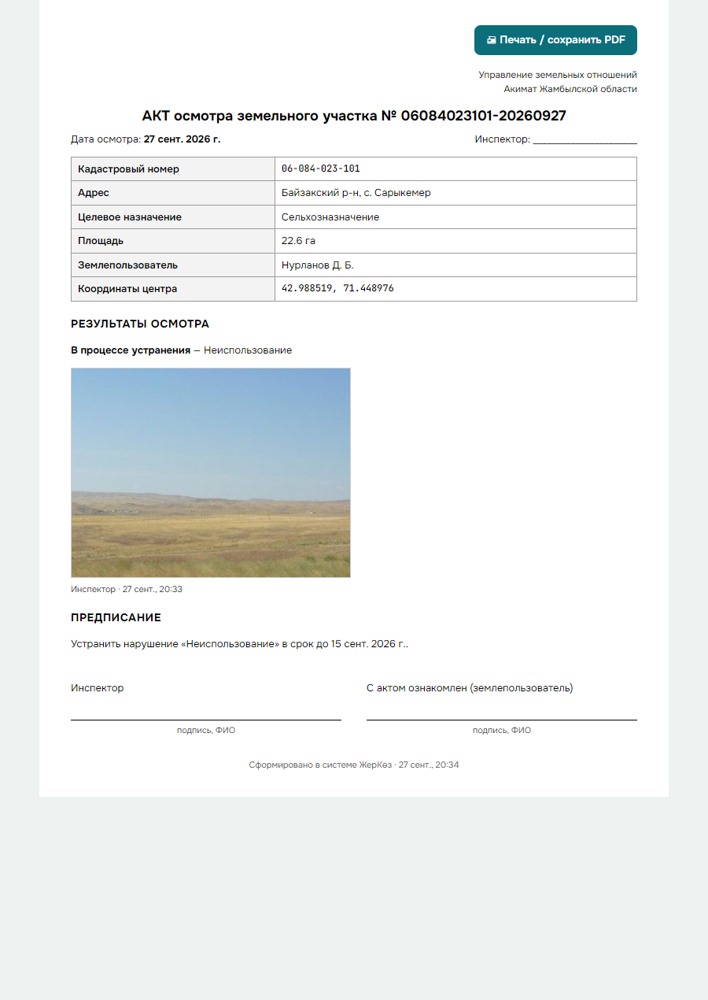
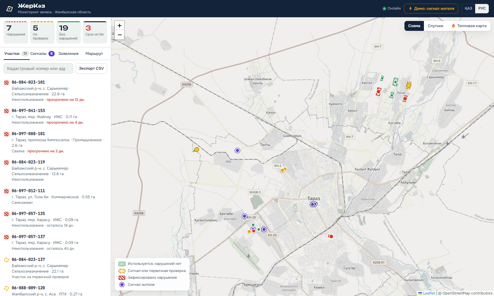

# ЖерКөз — цифровой мониторинг земель и сервис для граждан

Прототип (MVP) двустороннего сервиса для Жамбылской области, хакатон ZhambylHub.

- **Веб-панель инспектора**: карта участков с цветовой индикацией статуса, карточка участка с фотофиксацией, контрольными сроками и жизненным циклом нарушения «Выявлено → В процессе устранения → Устранено / Возвращено государству».
- **Telegram-бот для жителей**: статус заявления по трек-номеру с подпиской на изменения, база знаний по земельным услугам eGov и «Народный контроль» (геолокация → фото → описание).

**Замкнутый цикл в реальном времени:** житель отправляет сигнал в бот → точка сразу появляется на карте инспектора, участок желтеет → инспектор подтверждает нарушение → житель получает уведомление в Telegram.

Интерфейс и бот на двух языках: қазақша и русский.



| Карточка участка | Сигнал жителя | Мини-приложение |
|---|---|---|
|  |  |  |
| **Маршрут выезда** | **Акт осмотра** | **Общий вид** |
|  |  |  |

---

## Возможности

### Панель инспектора
| Функция | Как реализовано |
|---|---|
| Карта участков | Полигоны участков. Статус кодируется не только цветом, но и по картографическим правилам: 🟢 сплошная заливка, 🟡 пунктирный контур, 🔴 диагональная штриховка. Карту можно читать и при нарушениях цветового зрения |
| Обзорный масштаб | Мелкие участки (ИЖС ~30 м) на общем плане показываются точками в цвете статуса |
| Подложки и слои | Схема (OpenStreetMap), спутник (Esri World Imagery), тепловая карта сигналов |
| Карточка участка | Кадастровый номер, целевое назначение, площадь, землепользователь, открытые сигналы |
| Жизненный цикл | Пошаговый индикатор; допустимые переходы проверяются на сервере (например, нельзя начать устранение без контрольного срока) |
| Контрольный срок | Дата и быстрые кнопки +7/+14/+30 дней, подсветка просрочки (по времени Казахстана, UTC+5) |
| Фотофиксация | Загрузка фото инспектором (в том числе с камеры телефона); фото хранятся в БД |
| **Акт осмотра** | Печатная форма A4 одной кнопкой: реквизиты, сигналы, фото, предписание, строки подписей → «Сохранить как PDF» |
| **NDVI Sentinel-2** | Индекс вегетации за 12 месяцев. С ключами Copernicus — реальные снимки Sentinel-2 L2A с маской облаков; без них — симуляция |
| Сигналы жителей | Фото, описание, автоматическая привязка к участку (point-in-polygon), кнопки «Взять в проверку / Подтвердить / Отклонить / Устранено» |
| **Объединение дублей** | Сообщения в радиусе 50 м за 7 дней собираются в один сигнал; при смене статуса уведомляются все сообщившие |
| **Проверка EXIF** | Место и время съёмки из EXIF сверяются с точкой сигнала: «снято в 12 м от точки» или «снято в 40 км — подозрительно» |
| **Подсказка ИИ** | Тип нарушения по фото (Claude, анализ изображений) предзаполняет форму подтверждения. Без ключа — подсказка по ключевым словам описания |
| **Маршрут выезда** | Просроченные нарушения, участки на проверке и сигналы вне участков в оптимальном порядке; открытие в Google или Яндекс Картах |
| **Заявления** | Смена этапа с пояснением на RU/KZ, подписчики получают уведомление в Telegram |
| Реальное время | Server-Sent Events: новый сигнал появляется с пульсирующим маркером и уведомлением с фото |
| Дашборд | Счётчики, фильтры, поиск, экспорт реестра в CSV (открывается в Excel) |
| Доступ | Вход по паролю инспектора (подписанная HttpOnly-cookie), защита от перебора |

### Telegram-бот
- Выбор языка при первом запуске, дальше всё управляется кнопками меню, без команд.
- **📄 Статус заявления**: принимает `KZ-2026-042`, `kz 2026 42`, `КЗ-2026-042` (кириллицей) и номер своего сигнала `SIG-0007`. Номер можно прислать и без нажатия кнопки. Кнопка **🔔 Уведомлять об изменениях** включает подписку на заявление.
- **📚 База знаний**: изменение целевого назначения, продление аренды, участок под ИЖС. Сроки и документы сверены с паспортами услуг eGov.kz и Правилами оказания госуслуг в сфере земельных отношений (ред. 14.03.2025); у каждой процедуры прямая ссылка на услугу eGov.
- **🚨 Народный контроль**: геолокация (кнопкой, через 📎 или текстом `42.90, 71.37`) → 1–3 фото → описание → подтверждение. Бот сразу сообщает, на каком участке точка, и подсказывает отправить фото файлом, чтобы сохранился EXIF.
- **🗺 Карта района** (Telegram Mini App): сигналы рядом с жителем и «Мои сигналы». Публично видны только статус и тип нарушения, координаты округлены до ~10 м; жителя узнаём по подписи Telegram (`initData`, HMAC), без логинов. Кнопка появляется, когда у сервиса есть публичный https-адрес.
- **Антиспам**: не больше 5 сигналов в час и 20 в сутки с одного аккаунта (настраивается).
- **Уведомления**: при каждой смене статуса сигнала или этапа заявления житель получает сообщение на своём языке.

---

## Архитектура

```
┌─────────────── один процесс Python ───────────────┐
│                                                    │
│  Telegram-бот (aiogram 3)     REST API + SSE       │      React + Leaflet
│  polling | webhook            (FastAPI)  ◄─────────┼────► панель инспектора
│        └──────────┬───────────────┘                │
│              services/  ← бизнес-правила           │ ──► Copernicus (NDVI)
│              geo.py     ← вся геологика            │ ──► Claude API (фото)
│                   │                                │
└───────────────────┼────────────────────────────────┘
                    ▼
        PostgreSQL (геометрия в JSONB, фото в BYTEA)
```

- Бот и API работают с одним сервисным слоем. Поэтому сигнал из бота мгновенно доходит до карты через шину событий и SSE.
- Бот не зависит от веба: сервисы уведомляют жителя через интерфейс `notify`, а бот регистрирует свою реализацию при старте.
- Геометрия хранится как GeoJSON в JSONB, point-in-polygon считается в `services/geo.py` (shapely). Переход на PostGIS меняет только этот модуль.
- Фото хранятся в БД, поэтому сервис не зависит от временного диска облачного хостинга.
- Внешние интеграции (Copernicus, Claude) включаются ключами в `.env`; без ключей всё работает, эти функции просто скрыты.

**Стек:** Python 3.12 · FastAPI · SQLModel · psycopg 3 · PostgreSQL · shapely · Pillow · aiogram 3 · Anthropic SDK · pytest · React 18 · TypeScript · Vite · react-leaflet · leaflet.heat.

---

## Запуск локально

Нужно: **Python 3.11+**, **Node.js 18+**, **PostgreSQL 14+**.

### 1. Бэкенд

```bash
cd backend
python -m venv .venv
.venv\Scripts\activate          # Windows
# source .venv/bin/activate     # Linux / macOS
pip install -r requirements.txt
copy .env.example .env          # Linux / macOS: cp .env.example .env
```

В `backend/.env` обязательно только `DATABASE_URL`. Остальное по желанию: `BOT_TOKEN`, `INSPECTOR_PASSWORD`, ключи интеграций (описаны в `.env.example`).

```bash
python -m app.db create              # создать базу и таблицы
python -m app.seed.generate --reset  # демо-данные: 31 участок, 10 заявлений, сигналы с фото
```

### 2. Фронтенд

```bash
cd frontend
npm install
npm run build
```

### 3. Старт

```bash
cd backend
python -m app.main
```

Откройте **http://localhost:8000**. Документация API: http://localhost:8000/docs.

> Разработка фронтенда с горячей перезагрузкой: `npm run dev` в папке `frontend` (http://localhost:5173, запросы проксируются на :8000).

### Тесты

```bash
cd backend
pytest
```

81 тест на настоящем PostgreSQL (отдельная база `<имя>_test` создаётся автоматически). Они покрывают сквозной сценарий бота с подменённым Telegram, запросы к Copernicus с подменёнными ответами, авторизацию и webhook.

---

## Деплой на свой сервер (Oracle Cloud Always Free, любой VPS)

Сервис, PostgreSQL и Caddy (HTTPS от Let's Encrypt) поднимаются одной командой через Docker Compose. Работает на ARM (Ampere A1) и x86.

1. В облаке откройте входящие TCP-порты **80** и **443** (Oracle: VCN → Security List → Ingress Rules, *Destination* Port Range).
2. Подготовьте сервер (Docker и файрвол ОС): `scp deploy/setup-server.sh ubuntu@IP:/tmp/ && ssh ubuntu@IP "sudo bash /tmp/setup-server.sh"`.
3. На сервере создайте `/opt/zherkoz/deploy/.env` по образцу `deploy/.env.example`. Без своего домена используйте `DOMAIN=<IP-через-дефисы>.sslip.io`.
4. Выкатка текущего коммита с Windows: `.\deploy\deploy.ps1 -Server ubuntu@IP -Key путь\к\ключу` (с Linux/macOS — те же шаги: `git archive`, `scp`, `docker compose --env-file deploy/.env up -d --build`).

При первом старте база заполняется демо-данными (`SEED_ON_START=true`), бот сам переключается на webhook и получает кнопку мини-приложения.

## Деплой (Render, бесплатно)

1. Загрузите репозиторий на GitHub.
2. [render.com](https://render.com) → **New → Blueprint** → выберите репозиторий. `render.yaml` создаст веб-сервис (Docker) и PostgreSQL.
3. Заполните переменные: `BOT_TOKEN`, `INSPECTOR_PASSWORD`, по желанию `ANTHROPIC_API_KEY`, `COPERNICUS_CLIENT_ID/SECRET`.
4. После сборки откройте адрес сервиса: при первом старте база заполнится демо-данными (`SEED_ON_START=true`).

Бот в облаке сам переходит на webhook (адрес берётся из `RENDER_EXTERNAL_URL`), поэтому «засыпание» бесплатного сервиса ему не мешает: входящее сообщение будит сервис.

> ⚠️ Не запускайте локальную версию с тем же `BOT_TOKEN`, пока работает облачная: локальный polling снимет webhook. Для локальной разработки используйте отдельного тестового бота или оставьте `BOT_TOKEN` пустым.

Dockerfile универсален: подходит для Railway, Fly.io или VPS (`docker build -t zherkoz . && docker run -p 8000:8000 --env-file backend/.env zherkoz`).

---

## Демо-данные

Организаторы реальных данных не предоставляют, поэтому данные симулируются.

- **Участки**: 31 полигон в Таразе и пригородах. Из них 7 с нарушениями (3 просрочены), 5 на проверке, остальные без нарушений.
- **Сигналы**: 6 сигналов разных статусов плюс повторное сообщение о той же свалке (пример объединения дублей).
- **Тестовые трек-номера**: `KZ-2026-001`, `KZ-2026-007`, `KZ-2026-013`, `KZ-2026-018`, `KZ-2026-024`, `KZ-2026-029`, `KZ-2026-031`, `KZ-2026-036`, `KZ-2026-040`, `KZ-2026-042`. Они покрывают все этапы.
- **Страховка для демо**: кнопка «⚡ Демо: сигнал жителя» или `python -m app.seed.simulate`.
- **Импорт своих данных**: `python -m app.seed.import_geojson файл.geojson` (Polygon, MultiPolygon, Point; поля ищутся по вариантам имён).
- **Реальный NDVI**: `python -m app.services.ndvi --limit 5 --flag` загружает ряды Sentinel-2 для 5 крупнейших участков и ставит на проверку с/х участки без вегетации. Также есть кнопка «🛰 Загрузить из Sentinel-2» в карточке участка.

---

## Масштабирование

| Направление | Что уже заложено |
|---|---|
| Государственный кадастр (ЕГКН, АИС ГЗК) | Импорт GeoJSON с сопоставлением полей и обновлением по кадастровому номеру |
| Спутниковый мониторинг | Рабочая интеграция с Copernicus Statistical API (Sentinel-2 L2A, маска облаков по SCL); автоматическая постановка на проверку с/х участков без вегетации. Следующий шаг: ночной пересчёт по всем участкам |
| eGov | Сервис `applications` отделён от источника данных, тестовую таблицу можно заменить интеграцией; база знаний ссылается на реальные услуги |
| Геоданные | Вся геологика в одном модуле, переход на PostGIS без изменений API |
| Нагрузка | Бот поддерживает webhook и Redis для состояния диалогов; SSE-шину можно заменить на Redis Pub/Sub |
| Доступ | Пароль инспектора сейчас; следующий этап — вход через ЭЦП/IDP и права по районам |

---

## Структура

```
backend/
  app/
    main.py          точка входа (API + бот + раздача фронтенда + webhook)
    auth.py          вход инспектора
    models.py        таблицы: Parcel, Signal, Photo(+Blob), Application(+Subscription), Event, BotUser
    services/        бизнес-логика: parcels, signals, geo, photos, applications, route, ndvi, ai_vision, stats, notify
    api/             REST-эндпоинты, SSE, медиа
    bot/             Telegram-бот: обработчики, клавиатуры, тексты RU/KZ, база знаний
    seed/            демо-данные, симулятор сигнала, импорт GeoJSON
  tests/             pytest
frontend/src/
  App.tsx            сессия, состояние, реальное время
  components/        карта и слои, списки, карточки, заявления, маршрут, акт, вход
  i18n.tsx           словарь RU/KZ
Dockerfile, render.yaml   деплой
docs/screenshots/         скриншоты и GIF (пересоздаются docs/screenshots/capture.py)
docs/demo-script.md       сценарий 3-минутной демонстрации
```
